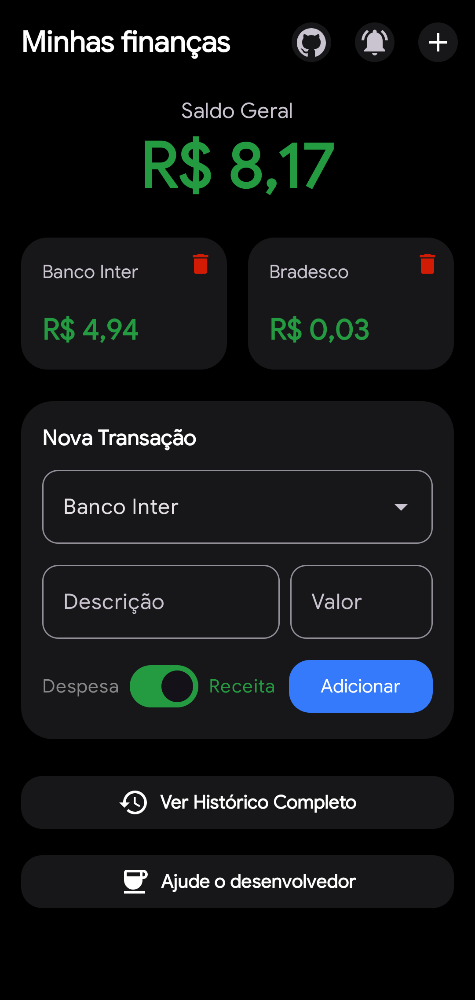
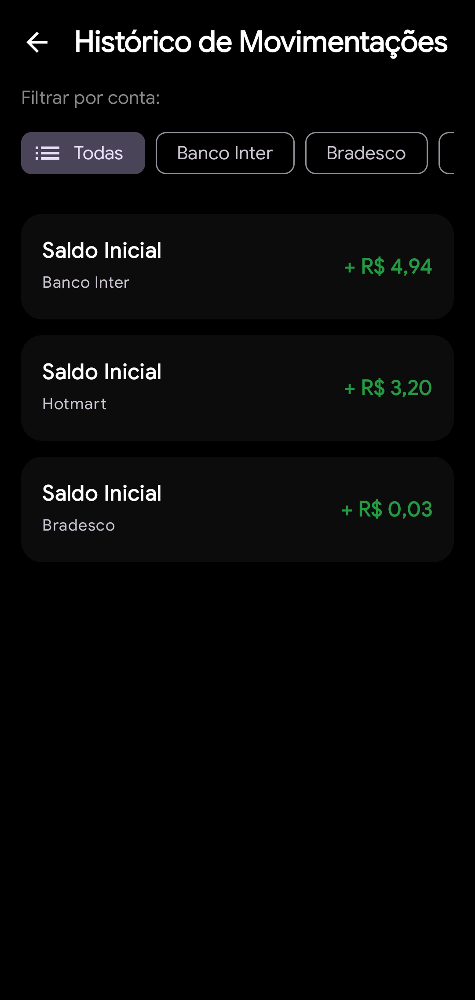
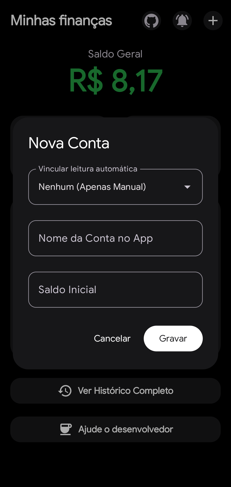
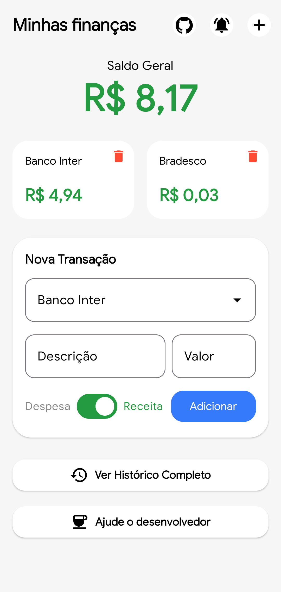
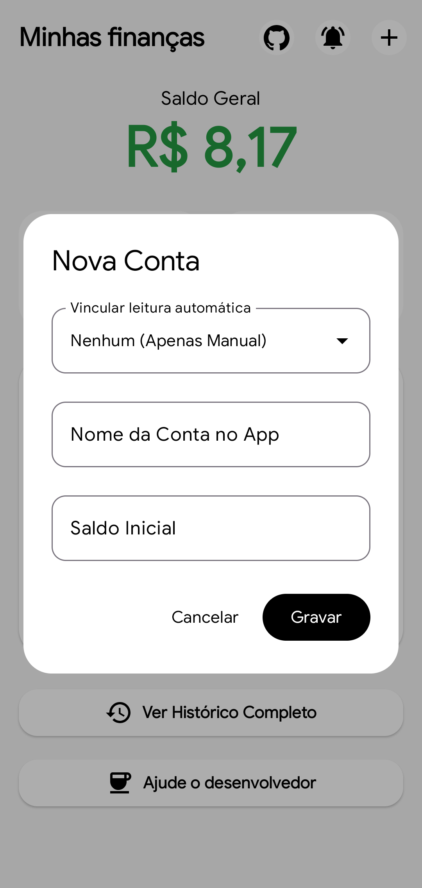
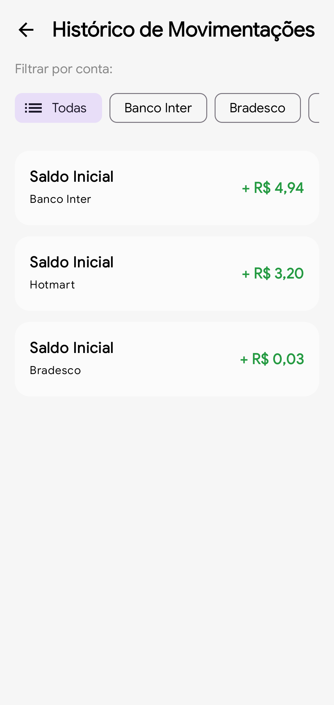

# Minhas Finanças

App  voltado para seu gereniamento financeiro
Open source e escrito 100% em kotlin

## Vantagens
1. Sem anuncios
2. Contas ilimitadas
3. Sincronição opcional automática via notificações (ainda em beta)
4. Descrição para receitas e despesas
5. Suporte para modo claro/escuro

## Capturas de Tela

## Deseja ajudar o desenvolvedor?

Com sua ajuda poderemos melhor o app e adicionar mais funções úteis para ele.

### Pix

ou

